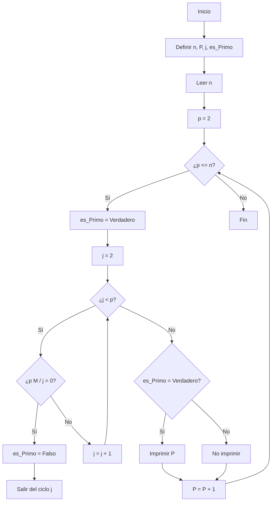

# Reto-3
Para este reto realice el proceso de hayar los numeros primos mediante un Pseudocódigo y un algoritmo
## Pseudocódigo
```
Inicio

    // Definición de variables
    Definir n Como Entero            // Número superior a 2
    Definir p Como Entero            // Variable para recorrer los números desde 2 hasta n
    Definir j Como Entero            // Variable para verificar si p tiene divisores
    Definir es_Primo Como Booleano    // para determinar si p es primo

    // Entrada
    Escribir "Ingrese un número natural n:"
    Leer n

    // Algoritmo para encontrar números primos menores o iguales a n
    Para p <- 2 Hasta n Hacer
        es_Primo <- Verdadero
        
        Para j <- 2 Hasta i - 1 Hacer
            Si p MOD j = 0 Entonces
                es_Primo <- Falso
                Salir del Para
            FinSi
        FinPara

        Si es_Primo = Verdadero Entonces
            Escribir p
        FinSi
    FinPara

Fin
```
## Explicacion Pseudocódigo
- Recorremos todos los números desde 2 hasta n.
- Para cada número p, revisamos si tiene algún divisor distinto de 1 y de sí mismo.
- 'Si no tiene divisores (es decir, es_Primo sigue siendo Verdadero), se imprime como número primo.

## Diagrama de flujo
Teniendo en cuenta que:
   - Definir n Como numero Entero superior a 2
   - Definir p Como Entero como una Variable para recorrer los números desde 2 hasta n
   - Definir j Como Entero como Variable para verificar si p tiene divisores
    Definir es_Primo Como Booleano para determinar si p es primo

gracias
